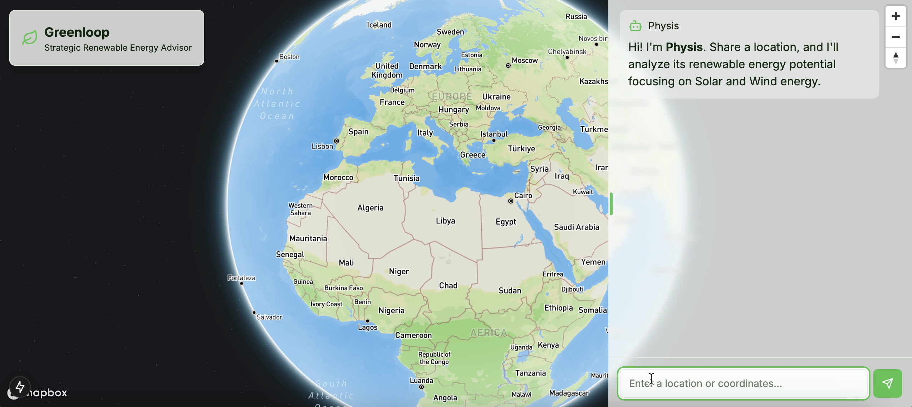

# Physis: Strategic Renewable Energy Advisor

**Physis** is a web platform, developed in 48 hours during a hackathon competition, designed to provide preliminary strategic advice for renewable energy systems. The platform contains an interactive map, an AI assistant, and dynamic data visualizations to analyze the potential of solar and wind energy systems at any location.



## Table of Contents

- [Features](#features)
- [Tech Stack](#tech-stack)
- [Project Structure](#project-structure)
- [Prerequisites](#prerequisites)
- [Installation](#installation)
- [Running Locally](#running-locally)
- [Environment Variables](#environment-variables)
- [Collaborators](#collaborators)
- [License](#license)


## Features

- **Interactive Energy Dashboard**  
  Combines real-time mapping and data visualization to present renewable energy insights.
  
- **AI Chat Assistant**  
  Concise recommendations based on your location data through an integrated chat interface.
  
- **Data Visualizations**  
  Dynamic charts and plots reveal monthly trends in solar radiation and wind speeds.
  
- **External API Integration**  
  Retrieves data from:
  - **NASA Power API** for solar and wind energy data
  - **Google Maps Static API** for satellite imagery
  - **Cohere Chat** for generating energy analysis
  - **Mapbox** for interactive, high-quality mapping


## Tech Stack

- **Framework:** Next.js with React  
- **Language:** TypeScript  
- **Styling:** Tailwind CSS  
- **Visualization:** Plotly for responsive charts and graphs


## Project Structure

- **app/**  
  Contains the main application layout and page components.
- **components/**  
  Reusable React components such as the energy dashboard, chat interface, maps, and UI elements.
- **lib/**  
  Utility functions and type declarations for interacting with external APIs and processing renewable energy data.
- **css/** & **public/**  
  Static assets and styling files.


## Prerequisites

Ensure you have the following installed:

- **Node.js** (latest LTS version recommended)
- **npm** package manager


## Installation

1. **Clone the repository:**
   ```bash
   git clone https://github.com/efsiatras/physis.git
   ```

2. **Navigate to the project directory:
   ```bash
   cd physis
   ```

3. **Install dependencies:**
   ```bash
   npm install
   ```


## Running Locally
Start the development server with:
   ```bash
   npm run dev
   ```

Then open [http://localhost:3000](http://localhost:3000) in your browser to view the application.

## Environment Variables

Create a ```.env.local``` file and configure the following environment variables:

- ```NEXT_PUBLIC_MAPBOX_TOKEN```: Your Mapbox API token for the interactive map.
- ```NEXT_PUBLIC_GOOGLE_MAPS_API_KEY```: Your Google Maps API key for satellite imagery.
- ```NEXT_PUBLIC_COHERE_API_KEY```: Your Cohere API key for the AI analysis.

Additional environment variables may be required for external API integrations. Refer to the project documentation for details.

## Collaborators
- [Efstathios Siatras](https://github.com/efsiatras "Efstathios Siatras")
- [George Moschovis](https://github.com/georgemoschovis "George Moschovis")
- [Ioannis Paterakis](https://github.com/gianpate "Ioannis Paterakis")
 
## License

Distributed under the MIT License. See [LICENSE](./LICENSE) for more information.
